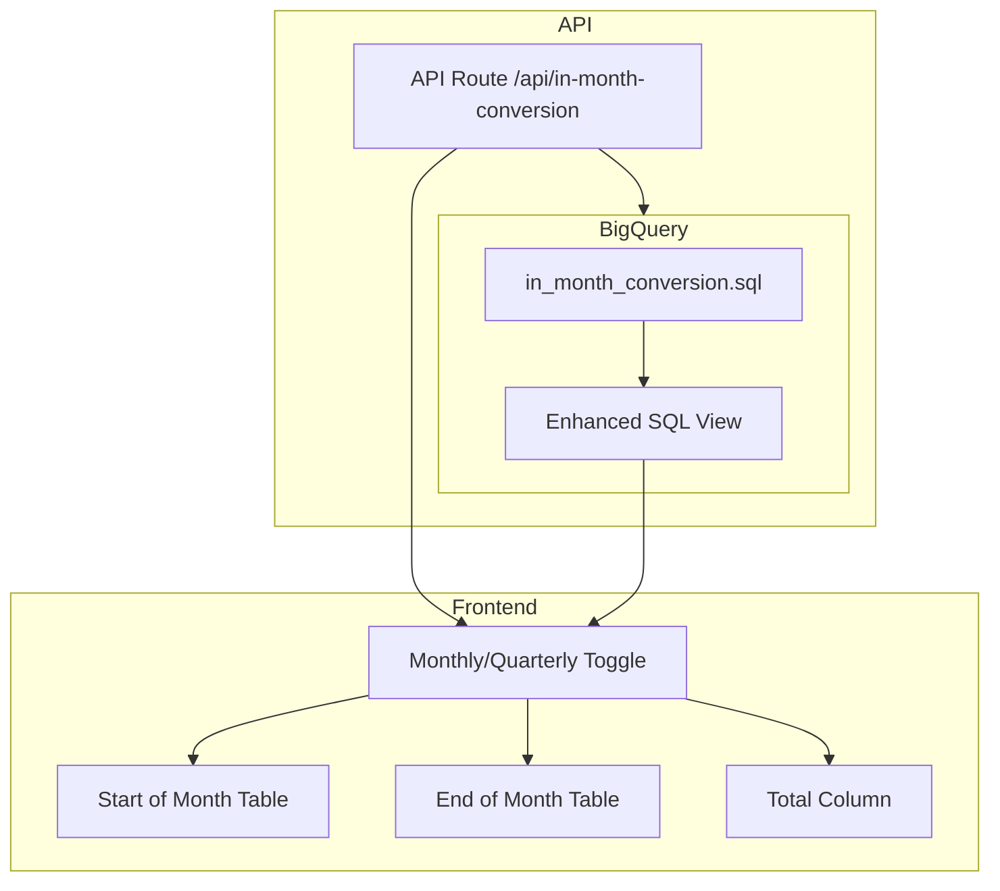

# Implementation Plan: In-Month Conversion Table View

## Overview
Replace the existing In-Month Conversion page with an enhanced table view that implements the complete data product specification from the provided screenshot.

---

## Architecture Overview



---

## Task 1: Update BigQuery SQL View

### File: `bigquery/in_month_conversion.sql`

#### 1.1 Add Period Type Configuration
Add a `period_type` parameter (MONTHLY/QUARTERLY) to generate appropriate date ranges.

```sql
-- Config for period type
period_config AS (
  SELECT
    CASE @period_type
      WHEN 'quarterly' THEN 'quarter'
      ELSE 'month'
    END AS period_name,
    CASE @period_type
      WHEN 'quarterly' THEN 3
      ELSE 1
    END AS month_interval
),
```

#### 1.2 Add New Columns for "End of Month Looking Back"

Add these columns to track won deal origins:

| Column Name | Type | Description |
|-------------|------|-------------|
| `total_won_count` | INT64 | Count of all deals won in period |
| `won_was_expected_count` | INT64 | Won deals that were expected at SOM |
| `won_was_later_month_count` | INT64 | Won deals pulled forward from future month |
| `won_created_in_month_count` | INT64 | "Bluebird" deals created and won same period |
| `total_won_arr` | FLOAT64 | Total ARR of won deals |
| `won_was_expected_arr` | FLOAT64 | ARR of expected deals that won |
| `won_was_later_month_arr` | FLOAT64 | ARR of pulled-forward deals that won |
| `won_created_in_month_arr` | FLOAT64 | ARR of bluebird deals |

#### 1.3 Add ARR Columns for SOM Section

| Column Name | Type | Description |
|-------------|------|-------------|
| `expected_count` | INT64 | Deals expected to close this period (SOM) |
| `expected_arr` | FLOAT64 | Total ARR of expected deals |
| `won_count` | INT64 | Expected deals that won |
| `won_arr` | FLOAT64 | ARR of expected deals that won |
| `lost_count` | INT64 | Expected deals that lost |
| `lost_arr` | FLOAT64 | ARR of expected deals that lost |
| `pushed_count` | INT64 | Expected deals still open at EOM |
| `pushed_arr` | FLOAT64 | ARR of expected deals still open |
| `pct_won` | FLOAT64 | won_count / expected_count |
| `pct_lost` | FLOAT64 | lost_count / expected_count |
| `pct_pushed` | FLOAT64 | pushed_count / expected_count |

#### 1.4 Implement Quarterly Aggregation
Create a CTE that groups monthly data into quarters when `period_type = 'quarterly'`.

#### 1.5 Implement Custom "Total" Column Logic

For the Total column, implement this multi-stage logic:

**Top Section (Start of Month):**
1. Find all deals open at the START of the first period (e.g., June 1, 2025)
2. Filter to deals with expected close date within the TOTAL range
3. Track outcomes through the ENTIRE period range
4. Deals pushed month-to-month are NOT double-counted

**Bottom Section (End of Month):**
1. Count unique deals won during the entire period
2. Classify each won deal by its origin at start of first period
3. Sum must reconcile: Expected + Later Month + Created = Total Won

---

## Task 2: Update TypeScript Types

### File: `dashboard/lib/bigquery.ts`

```typescript
export interface InMonthConversionRow {
  // Existing fields...
  period_type: 'monthly' | 'quarterly';
  period_start: string;
  period_end: string;
  period_label: string;
  
  // SOM Section - Counts
  expected_count: number;
  won_count: number;
  lost_count: number;
  pushed_count: number;
  
  // SOM Section - Percentages
  pct_won: number | null;
  pct_lost: number | null;
  pct_pushed: number | null;
  
  // SOM Section - ARR
  expected_arr: number;
  won_arr: number;
  lost_arr: number;
  pushed_arr: number;
  pct_won_arr: number | null;
  
  // EOM Section - Counts
  total_won_count: number;
  won_was_expected_count: number;
  won_was_later_month_count: number;
  won_created_in_month_count: number;
  
  // EOM Section - Percentages
  pct_won_was_expected: number | null;
  pct_won_was_later_month: number | null;
  pct_won_created_in_month: number | null;
  
  // EOM Section - ARR
  total_won_arr: number;
  won_was_expected_arr: number;
  won_was_later_month_arr: number;
  won_created_in_month_arr: number;
  
  // Final Metric
  pct_won_vs_entering_expected: number | null;
  
  // Metadata
  _loaded_at: string;
}
```

---

## Task 3: Update API Route

### File: `dashboard/app/api/in-month-conversion/route.ts`

Add support for `period_type` query parameter:

```typescript
// GET /api/in-month-conversion?period_type=monthly
// GET /api/in-month-conversion?period_type=quarterly
```

---

## Task 4: Update Frontend Component

### File: `dashboard/components/InMonthConversion.tsx`

#### 4.1 Add Monthly/Quarterly Toggle

```tsx
const [periodType, setPeriodType] = useState<'monthly' | 'quarterly'>('monthly');
```

#### 4.2 Implement Table Structure

**Section 1: "Start of Month, Looking Forward"**

| Metric | Jun-25 | Jul-25 | ... | Total |
|--------|--------|--------|-----|-------|
| **Expected in Month (# Deals)** | 31 | 28 | ... | 34 |
| Won in Month | 6 | 7 | ... | 5 |
| Lost | 3 | 5 | ... | 3 |
| Pushed | 22 | 16 | ... | 24 |
| % Won | 19% | 25% | ... | 15% |
| % Lost | 10% | 18% | ... | 9% |
| % Pushed | 71% | 57% | ... | 71% |
| **Expected in Month ($ ARR)** | $196,027 | ... | ... | ... |
| Won in Month ($) | $57,943 | ... | ... | ... |
| Lost ($) | $9,367 | ... | ... | ... |
| Pushed ($) | $128,717 | ... | ... | ... |

**Section 2: "End of Month, Looking Back"**

| Metric | Jun-25 | Jul-25 | ... | Total |
|--------|--------|--------|-----|-------|
| **Total Won (# Deals)** | 16 | 20 | ... | 15 |
| Was Expected in Month | 6 | 7 | ... | 5 |
| Was Expected in Later Month | 8 | 11 | ... | 7 |
| Created in Month | 2 | 2 | ... | 3 |
| % Was Expected | 38% | 35% | ... | 33% |
| % Was Later Month | 50% | 55% | ... | 47% |
| % Created | 12% | 10% | ... | 20% |
| **Total Won $ ARR** | $105,013 | ... | ... | ... |
| Was Expected ($) | $57,943 | ... | ... | ... |
| Was Later Month ($) | $41,417 | ... | ... | ... |
| Created ($) | $5,653 | ... | ... | ... |

**Final Metric Row**

| Metric | Jun-25 | Jul-25 | ... | Total |
|--------|--------|--------|-----|-------|
| **% Won vs Entering Expected** | 52% | 71% | ... | 15% |

#### 4.3 Styling Requirements

- Use fixed column widths for alignment
- Monospace font for numbers
- Color coding:
  - Won: Green (#3B7E6B)
  - Lost: Orange (#F47C44)
  - Pushed: Orange (#F47C44)
  - Expected: Blue (#1570B6)
- Sticky header and first column
- Responsive overflow handling

---

## Implementation Notes

### Reconciliation Rules

1. **SOM Section**: `Won + Lost + Pushed` MUST equal `Expected`
2. **EOM Section**: `Was Expected + Was Later Month + Created` MUST equal `Total Won`
3. **Final Metric**: `Total Won / Expected` is the logically correct formula (ignore screenshot discrepancies)

### Quarterly Toggle Behavior

When quarterly is selected:
- Columns become Q1-25, Q2-25, etc.
- SOM snapshot logic still uses month boundaries for accurate tracking
- Aggregation groups monthly outcomes into quarters
- Total column recalculates with quarterly boundaries

### Total Column Custom Logic

The Total column is NOT a simple sum. It requires:
1. A separate query to identify deals open at start of first period
2. Tracking those specific deals through the entire period range
3. Attribution based on original state, not period-by-period

---

## Files to Modify

| File | Changes |
|------|---------|
| `bigquery/in_month_conversion.sql` | Complete rewrite with new columns and logic |
| `dashboard/lib/bigquery.ts` | Update InMonthConversionRow interface |
| `dashboard/app/api/in-month-conversion/route.ts` | Add period_type parameter support |
| `dashboard/components/InMonthConversion.tsx` | Complete rewrite with new table layout |

---

## Verification Checklist

- [ ] SOM reconciliation: Won + Lost + Pushed = Expected for all periods
- [ ] EOM reconciliation: Was Expected + Later + Created = Total Won for all periods
- [ ] Monthly/Quarterly toggle correctly rebuilds all calculations
- [ ] Total column uses custom multi-stage query logic
- [ ] ARR values reconcile across sections
- [ ] Final metric formula: Total Won / Expected (not screenshot values)
